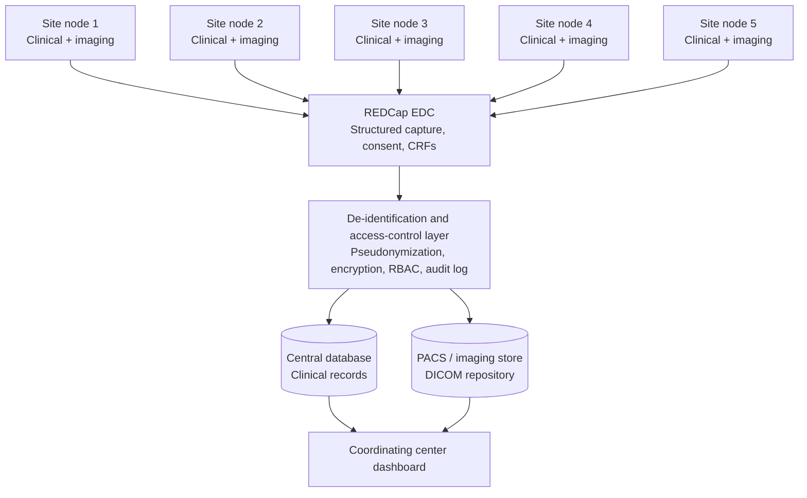
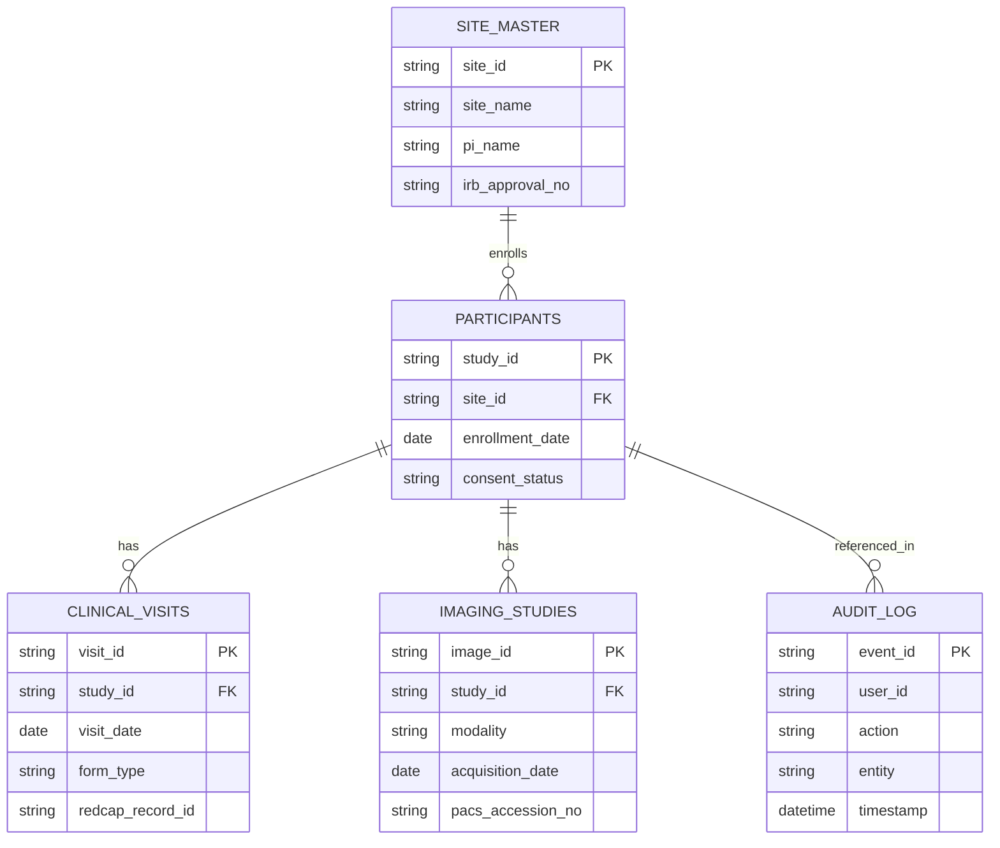

# Multicenter Clinical Research Data Platform — Technical Design

**Prepared for:** PRIDE-India Technical Screening Assignment
**Scope:** 5-node multicenter clinical research project — longitudinal clinical data, imaging data, AI/ML research

---

## Assumptions

- **5 nodes** = 5 hospital/research sites, each generating clinical (structured) + imaging (DICOM/JPEG) data, feeding into a central coordinating center.
- **RedCAP** = REDCap (Research Electronic Data Capture), the standard EDC tool used in Indian ICMR-funded multicentric studies.
- **ICMR guidelines** = the *National Ethical Guidelines for Biomedical and Health Research Involving Human Participants (ICMR, 2017)*, plus alignment with India's **Digital Personal Data Protection (DPDP) Act, 2023**, since ICMR's data-sharing policy explicitly references it.
- The deliverable is a design + implementation plan, not production code — though concrete schemas/APIs are described below.

---

## 1. Architecture overview

Five sites feed structured data into REDCap, imaging goes into a PACS repository, everything passes through a de-identification/access-control layer before landing centrally, and the coordinating team works from a single dashboard.

---

## 2. Dashboard — modules and roles

### User roles (RBAC, per ICMR & GCP expectations)

| Role | Access |
|---|---|
| Site data entry operator | Enters/uploads data for their own site only |
| Site Principal Investigator (PI) | Reviews/approves site data, views only their site |
| Central coordinator / study statistician | Views aggregated, de-identified data across all 5 sites |
| Data Manager / Admin | Manages users, audit logs, query resolution |
| Ethics/Compliance officer | Read-only access to consent status and audit trail |

### Core dashboard modules

| Module | Function |
|---|---|
| Patient enrollment | Register participant, generate a study ID (no PII), capture e-consent status |
| Clinical data entry | Demographics, history, lab values, follow-up visits — mapped to REDCap instruments |
| Imaging upload | DICOM/JPEG upload with automatic metadata stripping, linked to study ID |
| Data quality / query management | Auto-validation rules, missing-data flags, query resolution workflow between site and coordinating center |
| Cross-site monitoring | Enrollment progress, data completeness, protocol deviations — per node and aggregated |
| Audit trail | Every read/write logged: who, when, what field, from where |
| Export/reporting | De-identified dataset export for statisticians (CSV/REDCap API), restricted by role |

---

## 3. Data model (high level)

Note: participant tables carry **no name, no contact info, no MRN**. A separate, encrypted identity-linkage table (study_id → real identity) is stored **only at the originating site**, not centrally — this is the core privacy control.

---

## 4. REDCap integration plan

- Each of the 5 sites is either granted a project on a **single central REDCap instance using Data Access Groups (DAGs)** — so each site only sees its own records — or runs a federated REDCap instance syncing centrally. For 5 nodes, a central REDCap with DAGs is simpler to govern and is ICMR's typical recommendation for multicentric registries.
- **REDCap API** (token-based, HTTPS) is used to:
  - Push/pull records programmatically between the dashboard and REDCap
  - Trigger data validation/branching logic already defined in REDCap instruments
  - Export data (`records/export`) into the central research database for imaging linkage and analytics
- **Imaging is not stored in REDCap** — REDCap holds a reference/accession number only; actual DICOM files sit in a separate PACS or object store (e.g., Orthanc + S3-compatible storage), linked by study_id.
- REDCap features to leverage: e-Consent Framework, Data Access Groups, field-level audit trail, user roles, and the Longitudinal/Randomization modules for follow-up visits.

---

## 5. Data privacy — ICMR & regulatory alignment

Key controls, mapped to the **ICMR National Ethical Guidelines (2017)** and India's **DPDP Act, 2023**:

- **Informed consent** — e-consent captured in REDCap before any data entry; consent status gates dashboard access to that participant's record.
- **De-identification/pseudonymization** — study_id used everywhere in the shared/central system; identity-linkage key stored only at the site of origin, encrypted, accessible only to that site's PI/data manager.
- **Data minimization** — only variables defined in the approved protocol/CRF are collected.
- **Encryption** — TLS in transit; AES-256 at rest for both database and imaging store.
- **Access control & audit** — RBAC as above; every access event logged and periodically reviewed.
- **Data localization** — servers hosted within India per ICMR/DPDP expectations for health data; cross-border sharing requires ethics committee approval and a data transfer agreement.
- **Ethics oversight** — each site's IRB/Institutional Ethics Committee approval number stored in `site_master`; central Data and Safety Monitoring Board (DSMB) has read access to aggregated, de-identified data only.
- **Data retention & disposal** — retention period per protocol (ICMR typically recommends 5+ years post-publication), with a documented secure-deletion policy.
- **Breach response** — incident response plan and breach-notification procedure, as required under the DPDP Act.

---

## 6. Notes / open items

- This is a design-level plan. If a specific tech stack is required (e.g., Django/Node + PostgreSQL, a particular DICOM viewer), that can be specified as a follow-up.
- A working prototype dashboard (HTML/React) can be built on request as a next deliverable.
